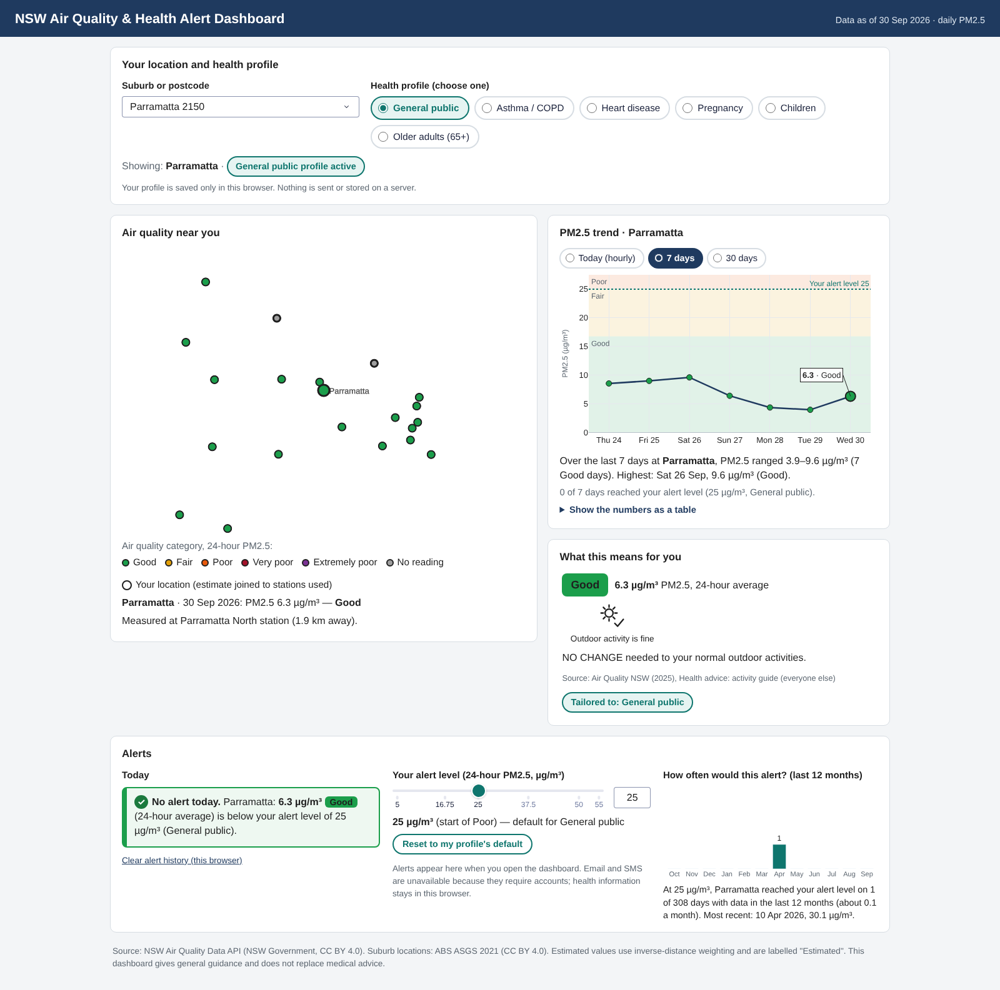

# NSW PM2.5 Air Quality & Health Insights Dashboard

**A portfolio project in reproducible air-quality data engineering and analytics.**

This repository packages a reproducible workflow that transforms New South Wales PM2.5 monitoring data into an interactive dashboard. It demonstrates data acquisition, quality controls, geographic enrichment, spatial estimation, and user-facing analysis.

**English** · [中文说明](README.zh-CN.md)

## Project overview

The dashboard brings together measured PM2.5 observations, NSW suburb and postcode lookup, location-level estimates, air-quality categories, and source-based health guidance. Users can search for a suburb or postcode, select a health profile, inspect recent trends, and review the air-quality context around a location.

### What it demonstrates

- An end-to-end data workflow: acquisition, cleaning, validation, geographic enrichment, and app-ready outputs.
- Data-quality handling for missing and negative observations, duplicate records, date ranges, and per-site completeness.
- Spatial estimation with inverse-distance weighting (IDW), with measured readings and estimates clearly distinguished.
- A modular Dash and Plotly application with map, trend, health-advice, location/profile, and alert panels.
- Reproducible offline execution using the data snapshot included in the repository.

### Snapshot at a glance

The included snapshot was collected on 6 October 2026. It contains daily PM2.5 observations from 1 January 2019 to 30 September 2026 and hourly observations for September 2026. The offline run produced 49 PM2.5 stations, 117,118 valid daily site-date rows, 32,579 valid hourly rows, and 4,542 NSW suburbs/localities. The exact environment and checks performed are recorded in [tests/VALIDATION.md](tests/VALIDATION.md).

## Dashboard

Screenshot captured in offline map mode (`MAP_STYLE=white-bg`), so station markers are shown without the street basemap. With an internet connection the map uses the CARTO Positron basemap.

The dashboard presents:

- **Location and profile:** search by NSW suburb or postcode and choose a general or sensitive health profile.
- **Nearby air quality:** view station readings and clearly labelled estimates for the selected location.
- **Recent trend:** inspect today, 7-day, and 30-day views when the snapshot contains the relevant data.
- **Health advice:** see guidance linked to the selected air-quality category and profile.
- **Personal alert controls:** view or adjust the alert threshold and review the local alert history.

Dashboard estimates are exploratory approximations. They are not measurements at every suburb and are not a substitute for the nearest monitoring station or professional health advice.

## Data workflow

~~~mermaid
flowchart TD
    A["NSW Air Quality API PM2.5 observations + site metadata"] --> B["Raw CSV snapshot data/raw"]
    B --> C["Clean and validate deduplicate, handle missing values, clip and flag negative values, standardise categories"]
    C --> D["Canonical processed tables in data/processed"]
    E["ABS ASGS Edition 3 SAL + Postal Areas"] --> F["NSW suburb lookup postcode + centroid"]
    G["Air Quality NSW health guidance"] --> H["Profile advice and default thresholds"]
    D --> I["Shared dashboard data loader"]
    F --> I
    H --> I
    I --> J["Dash + Plotly dashboard map · trends · advice · alerts"]
    J --> K["pytest validation panel combinations + search checks"]
~~~

### Pipeline stages

1. **Fetch observations** — scripts/fetch_pm25_data.py downloads station metadata, daily observations, and September 2026 hourly observations from the NSW API. A fresh fetch writes to a new dated folder under data/raw/refetch_* and leaves the included snapshot in place.
2. **Clean and summarise** — scripts/clean_pm25_data.py removes missing measurements and duplicate keys, clips negative PM2.5 readings to zero while retaining a flag, standardises category labels, converts hourly records to timestamps, and writes processed tables and a quality summary.
3. **Build the location index** — scripts/build_suburbs.py prepares the included ABS-derived NSW suburb list with postcodes and centroids for search and mapping.
4. **Build advice tables** — scripts/build_health_advice.py creates advice rows for six profiles across five air-quality categories and one default threshold per profile.
5. **Render and validate** — tests/test_dashboard_smoke.py renders dashboard panels across location, profile, threshold, and trend-range combinations and checks suburb-search ranking.

### Spatial estimation

For a selected location, the app uses the nearest monitoring station as a measurement when it is within 2 km. Otherwise, it estimates PM2.5 using inverse-distance weighting from up to five stations within 50 km, with an inverse-distance power of 2. The dashboard marks estimates separately from station readings. These are analytical estimates, not official station measurements.

## Run it

### Requirements

- Python 3.10 or later.
- Internet is needed only for a fresh NSW API download and for online map tiles. The included snapshot supports an offline pipeline run.

### Windows PowerShell

From the repository root:

~~~powershell
py -3.11 -m venv .venv
.\.venv\Scripts\Activate.ps1
python -m pip install --upgrade pip
python -m pip install -r requirements_pipeline.txt
python scripts/run_pipeline.py --use-included
~~~

The offline command processes the included snapshot, writes the canonical tables to `data/processed/`, and runs the pytest validation suite.

To fetch a fresh snapshot instead, run:

~~~powershell
python scripts/run_pipeline.py
~~~

A fresh download typically takes 10–15 minutes and depends on the NSW API being available. It writes to a dated folder under `data/raw/`.

To run only the dashboard after installing its dependencies:

~~~powershell
python -m pip install -r dashboard/requirements.txt
python dashboard/app.py
~~~

Then open http://127.0.0.1:8050. Stop the server with Ctrl+C.

To run the lint and formatting checks locally:

~~~powershell
python -m pip install -r requirements-dev.txt
ruff check .
ruff format --check .
~~~

### macOS / Linux

From the repository root:

~~~bash
python3 -m venv .venv
source .venv/bin/activate
python -m pip install --upgrade pip
python -m pip install -r requirements_pipeline.txt
python scripts/run_pipeline.py --use-included
~~~

To start the dashboard:

~~~bash
python dashboard/app.py
~~~

## Deploy with Render

The repository includes a Render Blueprint in `render.yaml` and a minimal web-service dependency file in `requirements_render.txt`. The configuration installs the dashboard runtime, starts the Dash WSGI server with Gunicorn, and checks the `/` health endpoint.

To deploy it, create a Blueprint from this public GitHub repository in Render, review the service settings from `render.yaml`, and apply them. The hosted dashboard uses the historical snapshot committed with the repository; map tiles still require an internet connection. On Render's free plan the service sleeps when idle, so the first visit can take about 30–60 seconds to load.

## Project structure

~~~text
.
├── data/
│   ├── raw/                  # Included NSW and ABS source extracts
│   └── processed/            # Canonical processed tables used by the dashboard
├── scripts/                  # Fetch, clean, geographic, advice, and orchestration scripts
├── tests/                    # pytest suite and recorded validation results
├── dashboard/
│   ├── app.py                # Dash application
│   ├── components/           # Location/profile, map, trend, advice, and alert panels
│   └── assets/               # Styles, accessibility patches, and icons
├── .github/workflows/ci.yml  # Automated lint and test checks
├── docs/images/              # Project screenshots
├── render.yaml               # Render web-service Blueprint
├── requirements_render.txt   # Dashboard and Gunicorn runtime dependencies
├── LICENSE                   # MIT License for project code
├── README.zh-CN.md           # Chinese README
├── requirements_pipeline.txt
└── requirements-dev.txt
~~~

## Data sources and attribution

- **PM2.5 observations and station metadata:** [NSW Air Quality Data API](https://data.airquality.nsw.gov.au/docs/index.html), operated by the NSW Government. The included extract is dated 6 October 2026. The API overview and user guide are available from [Air Quality NSW](https://www.airquality.nsw.gov.au/air-quality-data-services/air-quality-api).
- **Suburb and postcode geography:** [ABS ASGS Edition 3, Suburbs and Localities](https://www.abs.gov.au/statistics/standards/australian-statistical-geography-standard-asgs/edition-3-july-2021-june-2026/non-abs-structures/suburbs-and-localities) and [ABS digital boundary files](https://www.abs.gov.au/statistics/standards/australian-statistical-geography-standard-asgs/edition-3-july-2021-june-2026/access-and-downloads/digital-boundary-files). The project uses transformed suburb/locality centroids and 2021 Postal Area information for lookup and display; ABS suburb approximations are for statistical use and are not legal boundaries.
- **Health guidance:** [Air Quality NSW Health advice and activity guide](https://www.airquality.nsw.gov.au/health-advice) and [Bushfire smoke health advice](https://www.airquality.nsw.gov.au/health-advice/bushfire-health-advice). Advice is presented for information only and does not replace medical care.
- **Data licensing:** the source files and their stated terms remain those of the respective providers. Where the source material is identified as [CC BY 4.0](https://creativecommons.org/licenses/by/4.0/), attribution is retained. The repository does not imply NSW Government or ABS endorsement.

## Validation

See [tests/VALIDATION.md](tests/VALIDATION.md) for the exact environment, commands, dataset counts, and results recorded for this release. The included offline pipeline runs against the dated snapshot; live API results may change when the provider revises historical data.

## Responsible use and limitations

- This is a personal analytical dashboard, not an official NSW Government service.
- Suburb values may be interpolated estimates rather than local measurements; check station labels and distance.
- The bundled data is a historical snapshot and is not a live air-quality feed.
- Health guidance is general information derived from the linked NSW sources. For personal medical advice, contact a qualified health professional.
- Map background tiles require an internet connection; set `MAP_STYLE=white-bg` to run the map fully offline. Charts and local data remain available offline.

## License

The project code is released under the [MIT License](LICENSE). Bundled datasets and third-party assets remain subject to their respective providers' terms; see [Data sources and attribution](#data-sources-and-attribution).
